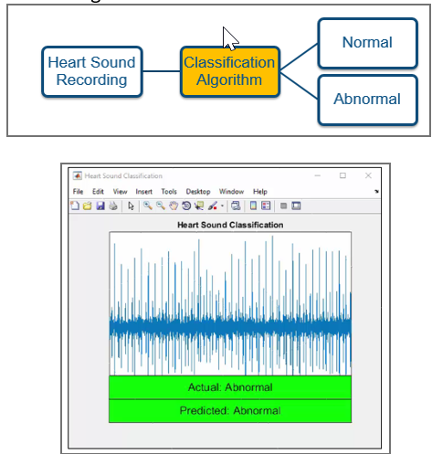
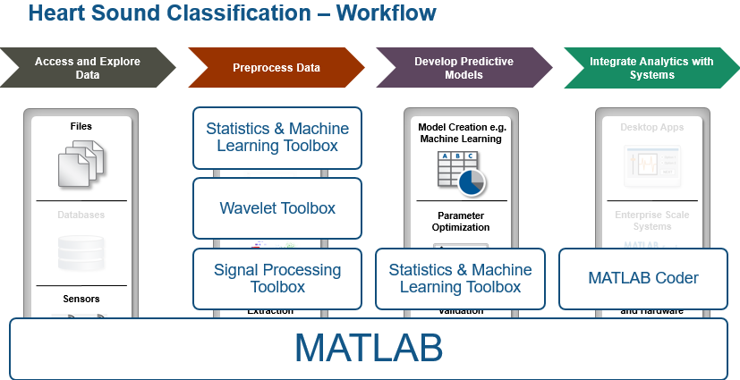
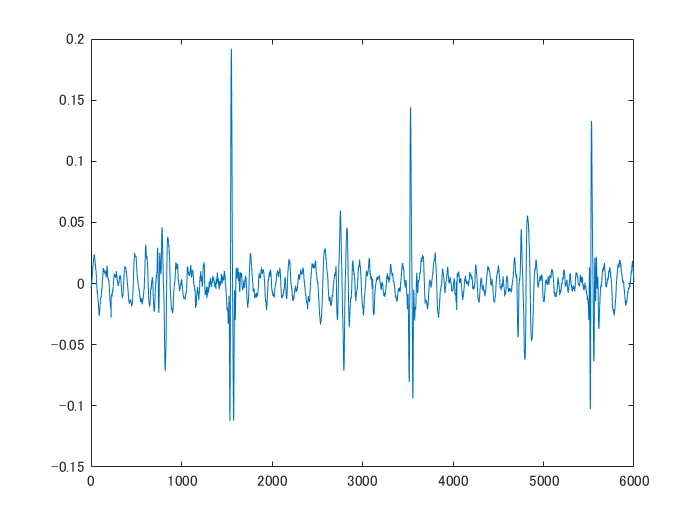
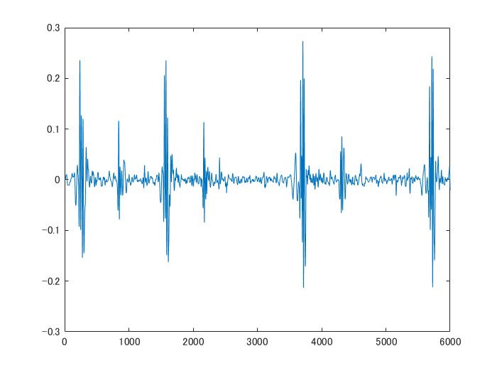
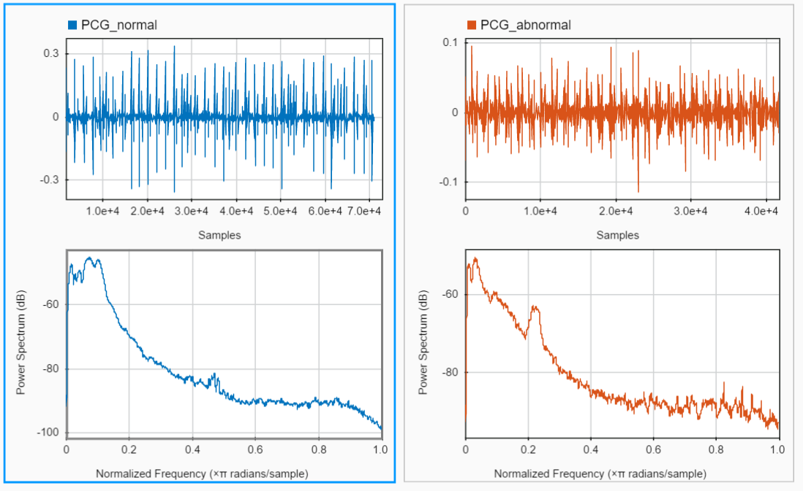
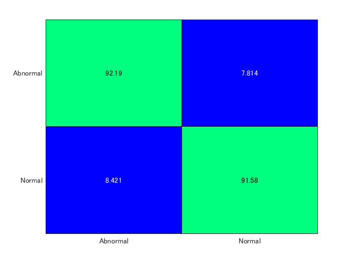
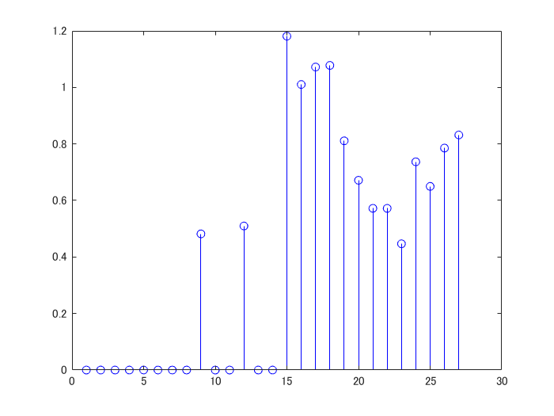
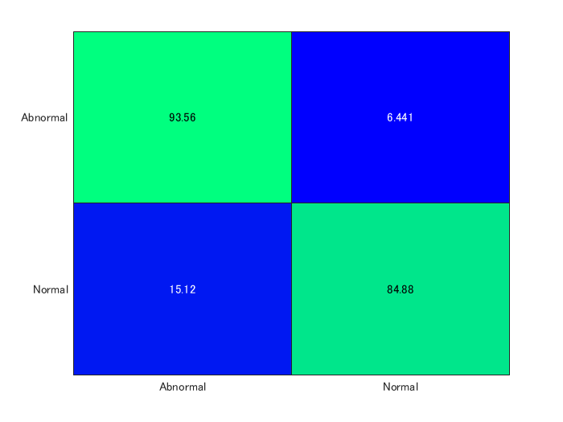

# PhysioNet Challenge 2016: 心音の正常・異常分類


このスクリプトは、組み込み機械学習アプリ開発のための一連のワークフロー、具体的にはデータの読み込み、特徴抽出、各種アルゴリズムの検討、モデルのチューニング、そしてプロトタイプ配布までを紹介します。特にここでは、危険な心臓病のリスクがある患者を診察する医療業務で応用可能で、熟練臨床医への依存軽減につながる、心音の"正常"と"異常"を分類するアルゴリズムを開発します。


**注意：このスクリプトはセクション毎に個別に実行していくことを想定しています。**信号アナライザや分類学習器などのアプリの使用を意図しているためです。


Copyright 2019-2020 The MathWorks, Inc.


下図は、アプリのプロトタイプの概観スクリーンショットです。





ここでは [PhysioNet challenge of 2016](https://physionet.org/challenge/) で提供される3000以上の正常・異常の心音録音データを使います。これらの録音データは心音計により4箇所（動脈、肺、三尖弁、僧帽弁）の位置で記録されています。


まずデータを準備します。最初にこのスクリプトを実行する際は、このステップで、PhysioNetのウェブサイトからデータをダウンロードします。既に "Data" ディレクトリがある場合はこのステップはスキップされます。あるいは、もし実際の特徴抽出処理やモデルの学習（どちらも実行に数分かかります）を行わない場合、学習と評価用のデータセットを用意する必要はありません。その場合は代わりに、zipファイルを展開して、.matファイルからあらかじめ抽出した特徴量を読み込み、分類学習器でモデルを学習させます。


***Note***: インターネットの接続状況によって時間がかかる場合があります


```matlab
getTrainingData = 0; % option to skip downloading training data (may take long time, 185 MB)
if ~exist('training.zip') && getTrainingData%#ok 
    % fetch training data from physionet site. 
    % NOTE: unless you plan to execute the feature extraction, don't worry if there is an error here,
    %       we only need access to the training set to run the feature extraction 
    try
        training_url = 'http://www.physionet.org/physiobank/database/challenge/2016/training.zip';
        websave('training.zip', training_url);
    catch
        warning("Failed to access heart sound training data on physionet.org - check your internet connection or whether path %s needs updating",training_url)
    end
    
    unzip('training.zip', 'Data\training')
end

if ~exist('validation.zip')%#ok 
   % you need the validation data only for running the prototype app
   try
       validation_url = 'http://www.physionet.org/physiobank/database/challenge/2016/validation.zip';
       websave('validation.zip', validation_url);
   catch
       warning("Failed to access heart sound validation data on physionet.org - check whether path %s needs updating", validation_url)
   end
   unzip('validation.zip','Data\');
end

% make sure we have copies of the two example files in the main directory
if exist('Data\validation')%#ok
    copyfile 'Data\validation\a0001.wav';
    copyfile 'Data\validation\a0011.wav';
end
```


現在のフォルダーとサブフォルダーをパスとして加え、スクリプトが、サブディレクトリ　"Data" に格納した録音データと、"HelperFunctions"に保存されたMATLAB関数各種へアクセスできるようにします。


```matlab
addpath(genpath(pwd));
addpath('.\HelperFunctions\');
```


本デモの概要は、典型的な機械学習ワークフローの4つのフェーズを想定して構成されています：


   1.  データへのアクセスと解析 
   1.  データの前処理 
   1.  予測モデルの作成 
   1.  モデルのシステムへの統合 


下図は、ワークフローの各フェーズで活用するToolboxを示しています。





# 異常な心音を再生すると？


解析対象の特性を把握するために、心拍信号の音を再生してみます。MATLABはオーディオ信号の再生機能を持っています。この例では、正常と異常の心音サンプルを、データセットからメインのディレクトリにコピーします。


```matlab
[PCG_abnormal, fs] = audioread('a0001.wav');
p_abnormal = audioplayer(PCG_abnormal, fs);
play(p_abnormal, [1 (get(p_abnormal, 'SampleRate') * 3)]);

% Plot the sound waveform
plot(PCG_abnormal(1:fs*3))
```



# 正常な心音の音は？
```matlab
[PCG_normal, fs] = audioread('a0011.wav');
p_normal = audioplayer(PCG_normal, fs);
play(p_normal, [1 (get(p_normal, 'SampleRate') * 3)]);

% Plot the sound waveform
plot(PCG_normal(1:fs*3))
```




# 周波数領域では信号はどう見える？


分類器で判別するこれらの信号の詳細を把握するために、周波数成分を観測してみましょう。これら二つの信号のパワースペクトルを評価・比較するには、MATLABの [Signal Analyzer](https://www.mathworks.com/help/signal/ug/getting-started-with-signal-analyzer-app.html) アプリが使用できます。


```matlab
signalAnalyzer(PCG_abnormal, PCG_normal)
```


アプリを起動すると、二つのパネルにそれぞれの信号が表示され（左上のグリッドボタンを使います）、各波形の下に、スペクトルが生成されます（スペクトルボタンを押す）。異常音においては、0.2ラジアン付近にスパイクが現れるのに対して、正常音はy軸付近に成分が集中しています。





# データ読み込みの準備


メモリに録音データを読み込む際、大規模データを扱う必要があったり、データファイルが複数のフォルダに分散している場合は、[fileDatastore](https://www.mathworks.com/help/matlab/ref/filedatastore.html) を使用すると便利です。read関数では多種の異なるファイルフォーマットへのアクセスが可能ですが、読み込みには多少のカスタマイズが必要になることがあります。


```matlab
training_fds = fileDatastore(fullfile(pwd, 'Data', 'training'), 'ReadFcn', @importAudioFile, 'FileExtensions', '.wav', 'IncludeSubfolders', 1);
```
\matlabheading{}
# ファイル名とラベルのついたテーブルの作成


"ラベル"（あるいは、"グランドトゥルース"）は、各データセットの真のカテゴリのことで、この分類処理に適した機械学習を適用するために重要です。ここで使用するデータセットは、学習用と評価用のデータの保存された各サブフォルダ内のPREFERENCE ファイルにある、目的のオーディオファイル（録音データ）と合致したラベル情報を持ちます。このセクションでは、これらPREFERENCE.csvファイルを読み込み、ファイル名と、ラベル情報を持ったテーブルを作成します。このステップは、次のステップの特徴量抽出が必要な場合にのみ実行する必要があります。


```matlab
data_dir = fullfile(pwd, 'Data', 'training');
folder_list = dir([data_dir filesep 'training*']);

reference_table = table();

for ifolder = 1:length(folder_list)
    disp(['Processing files from folder: ' folder_list(ifolder).name])
    current_folder = [data_dir filesep folder_list(ifolder).name];
    
    % Import ground truth labels (1, -1) from reference. 1 = Normal, -1 = Abnormal
    reference_table = [reference_table; importReferencefile([current_folder filesep 'REFERENCE.csv'])];
end
```
```
Processing files from folder: training-a
Processing files from folder: training-b
Processing files from folder: training-c
Processing files from folder: training-d
Processing files from folder: training-e
Processing files from folder: training-f
```

# 実際の心音信号からの特徴量抽出


次に、生データからの特徴抽出を行います。実際の心音信号から特徴を抽出するために、MATLABで使用可能な統計および信号処理関数を用います。以下のセクションでは、各々の録音から28の特徴を抽出し、各録音データを5秒間の心音ごとに分割します。


約3000の録音データの前処理には、以下のコードをParallel Computing Toolboxで並列処理を行ったとしても、しばらく時間がかかります。待ち時間を回避するために、本デモのデフォルト設定では、あらかじめ抽出された特徴量を、Feature Tableから読み込む様にしています。


```matlab
if ~exist('FeatureTable.mat')%#ok 
    % Window length for feature extraction in seconds
    win_len = 5;
    
    % Specify the overlap between adjacent windows for feature extraction in percentage
    win_overlap = 0;
    
    % Initialize feature table to accumulate observations
    feature_table = table();
    
    % Use Parallel Computing Toobox to speed up feature extraction by distributing computation across available processors
    
    % Create partitions of the fileDatastore object based on the number of processors
    n_parts = numpartitions(training_fds, gcp);
    
    % Distribute computation across available processors by using parfor
    parfor ipart = 1:n_parts
        % Get partition ipart of the datastore.
        subds = partition(training_fds, n_parts, ipart);
        
        % Extract features for the sub datastore
        feature_table = [feature_table; extractFeatures(subds, win_len, win_overlap, reference_table)];
        
        % Display progress
        disp(['Part ' num2str(ipart) ' done.'])
    end
    save('FeatureTable', 'feature_table');
else % simply load the precomputed features
    load('FeatureTable.mat');
end

% Take a look at the feature table
disp(feature_table(1:5,:))
```
```
     meanValue     medianValue    standardDeviation    meanAbsoluteDeviation    quantile25    quantile75    signalIQR    sampleSkewness    sampleKurtosis    signalEntropy    spectralEntropy    dominantFrequencyValue    dominantFrequencyMagnitude    dominantFrequencyRatio    MFCC1     MFCC2     MFCC3       MFCC4       MFCC5       MFCC6      MFCC7      MFCC8       MFCC9      MFCC10     MFCC11      MFCC12     MFCC13       class   
    ___________    ___________    _________________    _____________________    __________    __________    _________    ______________    ______________    _____________    _______________    ______________________    __________________________    ______________________    ______    ______    ______    _________    ________    _______    _______    ________    ________    ______    ________    ________    _______    __________

    -2.7121e-05     0.00015259         0.02033                0.01228           -0.0083771    0.0082092     0.016586         1.4484            21.147           -2.7659           0.28682                17.098                     0.066932                    0.22436            88.196    7.3405    6.4674    -0.051239     -2.5149     -3.143    -1.9638    -0.11315    -0.28488    1.6218    -0.53338     -1.6926    -2.0239    'Abnormal'
    -4.3304e-06     6.1035e-05        0.021358               0.012943           -0.0079041    0.0081482     0.016052        0.59825            16.507           -2.7017           0.29779                15.633                     0.051741                    0.16802            88.048    7.9407    6.6784     -0.33812     -1.7421    -4.6783    -2.7332       2.394     0.10001    2.9168     -1.3413    -0.90557    -1.4914    'Abnormal'
     1.6452e-05     0.00036621        0.021588               0.013572           -0.0092163    0.0085297     0.017746          1.039            14.776           -2.6434           0.23184                 26.38                     0.090545                    0.38065            90.012    8.0685    1.5072      -2.2183    -0.55386    -1.3512    -2.2507      1.1322    -0.42672    2.3943      1.5946     -2.0933    -1.3693    'Abnormal'
    -7.8979e-05    -0.00015259        0.019643               0.012688           -0.0090179     0.008606     0.017624        0.78882            13.674            -2.716           0.25299                24.915                     0.065139                     0.4354            87.303    7.4797    7.4607     -0.73843    -0.74028    -4.1818    -2.0782      1.8257       0.865    2.4926    -0.91656    -0.55254    -2.2298    'Abnormal'
     4.4342e-06     0.00048828        0.023276               0.012722           -0.0072021    0.0073853     0.014587         1.2829            21.825           -2.7703           0.27842                30.288                     0.051823                    0.34453            88.171    7.8968    6.8715      0.85403    -0.82052    -5.8922    -2.0241      1.5196    -0.64708     3.923     -0.5634     -1.7582    -0.4827    'Abnormal'
```

# 学習、比較、分類器の選択 


特徴量を抽出した後は、機械学習のワークフロー、すなわち、各種予測モデルの学習作業に入っていきます。ここでは、インタラクティブに学習、比較、分類器の選択が行える、[Classification Learner App](https://www.mathworks.com/help/stats/classificationlearner-app.html) を使用します。


```matlab
classificationLearner
```


ワークスペースから、変数として `feature_table` を選択し、モデル検証データを30% とするホールドアウト検定を選ぶか、より多くの学習データを確保するために、交差検定を選択してもよいでしょう。


線形回帰、SVM、決定木等の各種手法で学習させます。ホールドアウト検定データにおいて、どれが最も高い精度を出すか調べます。また、混合行列を調べ、実用的な観点から、正常な心音と異常な心音との誤分類が意味することを検討します。


多くの異常音が、正常であると誤分類されており、これは、深刻な心臓病を持つかもしれない患者を誤診断する可能性があることを意味するため、臨床診断において重大な問題となりかねません。モデルの精度を改善するために、以下のセッションでは、さらなる最適化を行っていきます。


# データを学習用とテスト用に分ける 


これらの最適化の手順は、プログラムで処理する必要があります。従って、前のセクションにおいて分類学習器アプリ内でデータを分割した作業と同様に、学習データの30%をテスト用に保持します。[cvpartition](https://www.mathworks.com/help/stats/cvpartition.html) を使用し、学習用とテスト用にデータを分割します。また、[grpstats](https://www.mathworks.com/help/stats/grpstats.html) により、各クラスとして観測された数をカウントします。


```matlab
rng(1)
% Use 30% of data for training and remaining for testing
split_training_testing = cvpartition(feature_table.class, 'Holdout', 0.3);

% Create a training set
training_set = feature_table(split_training_testing.training, :);

% Create a test set (won't be used until much later)
testing_set = feature_table(split_training_testing.test, :);

grpstats_training = grpstats(training_set, 'class', 'mean');
disp(grpstats_training(:,'GroupCount'))
```
```
                GroupCount
                __________

    Abnormal       2211   
    Normal         6900   
```

# 誤分類コストをふまえた分類器の学習


データ内の"異常"の観測の少なさを補償するため、また、異常音の誤分類をより少なくする様に分類器にバイアスをかけるために、"異常"クラスに対してより高い誤分類コストを設定する、cost関数を使用します。同時に、モデルパラメータの最適な値を見つけるために、[Bayesian Optimization](https://www.mathworks.com/help/stats/bayesian-optimization-workflow.html)を用いて、ハイパーパラメータのチューニングを行います。分類学習器アプリでは、決定木のアンサンブルが、SVMの分類器よりも高性能であったため、ここではアンサンブルを使用します。 


```matlab
% Assign higher cost for misclassification of abnormal heart sounds
C = [0, 20; 1, 0];

% Create a random sub sample (to speed up training) from the training set
%subsample = randi([1 height(training_set)], round(height(training_set)/4), 1);
subsample = 1:height(training_set);

rng(1);

% Create a 5-fold cross-validation set from training data
cvp = cvpartition(length(subsample),'KFold',5);

if ~exist('TrainedEnsembleModel.mat')%#ok
    % perform training only if we don't find a saved model

    % train ensemble of decision trees (random forest)
    disp("Training Ensemble classifier...")
    
    % bayesian optimization parameters (stop after 15 iterations)
    opts = struct('Optimizer','bayesopt','ShowPlots',true,'CVPartition',cvp,...
            'AcquisitionFunctionName','expected-improvement-plus','MaxObjectiveEvaluations',15);    
    trained_model = fitcensemble(training_set(subsample,:),'class','Cost',C,...
        'OptimizeHyperparameters',{'Method','NumLearningCycles','LearnRate'},...
        'HyperparameterOptimizationOptions',opts)

    save('TrainedEnsembleModel', 'trained_model');
else
    % load previously saved model
    load('TrainedEnsembleModel.mat')
end

% Predict class labels for the validation set using trained model
% NOTE: if training ensemble without optimization, need to use trained_model.Trained{idx} to predict
predicted_class = predict(trained_model, testing_set);

conf_mat = confusionmat(testing_set.class, predicted_class);

conf_mat_per = conf_mat*100./sum(conf_mat, 2);

% Visualize model performance in heatmap
labels = {'Abnormal', 'Normal'};
heatmap(labels, labels, conf_mat_per, 'Colormap', winter, 'ColorbarVisible','off');
```




# 近傍成分分析による特徴量の選択


上記モデルの精度は非常に良好でしたが、小規模な組み込デバイスへの実装には大きすぎます。従ってこのセクションでは、28の特徴量のうち、予測精度の寄与分の大きな特徴量を部分的に用いた、よりコンパクトなモデルの学習を考えます。[Neighborhood Component Analysis](https://www.mathworks.com/help/stats/neighborhood-component-analysis.html) (NCA) は、抽出した特徴の冗長分を最小化し、分類するためにより有用な情報をもつ特徴量だけを分別するための手法です。 


```matlab
runNCA = 1;   % set this to 0 to skip

if ~runNCA && exist('SelectedFeatures.mat')%#ok
    % Load saved array of selected feature indexes
    load('SelectedFeatures.mat')
else % Perform feature selection with neighborhood component analysis
    rng(1)
    mdl = fscnca(table2array(training_set(:,1:27)), ...
        table2array(training_set(:,28)), 'Lambda', 0.005, 'Verbose', 0);
    
    % Select features with weight above 0.1
    selected_feature_indx = find(mdl.FeatureWeights > 0.1);

    % Plot feature weights
    stem(mdl.FeatureWeights,'bo');
    
    save('SelectedFeatures.mat','selected_feature_indx');
end
```



```matlab
% Display list of selected features
disp(feature_table.Properties.VariableNames(selected_feature_indx))
```
```
  1 列から 8 列

    'sampleKurtosis'    'dominantFrequency…'    'MFCC1'    'MFCC2'    'MFCC3'    'MFCC4'    'MFCC5'    'MFCC6'

  9 列から 15 列

    'MFCC7'    'MFCC8'    'MFCC9'    'MFCC10'    'MFCC11'    'MFCC12'    'MFCC13'
```

# 選択された特徴量を使った学習


配布用としてよりコンパクトなモデルにするために選択された特徴量だけを使ってモデルを学習させます。ファイルサイズが6MBから4MBまで削減したことを確認できます。さらに小規模にするために、他のモデルも試すこともできます。


```matlab
if ~exist('TrainedEnsembleModel_FeatSel.mat')%#ok
    rng(1)
    opts = struct('Optimizer','bayesopt','ShowPlots',true,'CVPartition',cvp,...
            'AcquisitionFunctionName','expected-improvement-plus','MaxObjectiveEvaluations',15);    
    trained_model_featsel = fitcensemble(training_set(subsample,selected_feature_indx),training_set.class(subsample),'Cost',C,...
        'OptimizeHyperparameters',{'Method','NumLearningCycles','LearnRate'}, 'HyperparameterOptimizationOptions',opts)
    save('TrainedEnsembleModel_FeatSel', 'trained_model_featsel');
else
    load('TrainedEnsembleModel_FeatSel.mat')
end

% Predict class labels for the validation set using trained model
predicted_class_featsel = predict(trained_model_featsel, testing_set(:,selected_feature_indx));

conf_mat_featsel = confusionmat(testing_set.class, predicted_class_featsel);

conf_mat_per_featsel = conf_mat_featsel*100./sum(conf_mat_featsel, 2);

labels = {'Abnormal', 'Normal'};

% Visualize model performance
% probably custom AE version: heatmap(conf_mat_per_featsel, labels, labels, 1,'Colormap', 'red','ShowAllTicks',1,'UseLogColorMap',false,'Colorbar',true);
heatmap(labels,labels,conf_mat_per_featsel, 'Colormap', winter, 'ColorbarVisible','off');
```




# コード生成


録音信号とサンプリング周波数を入力とし、心音の分類ラベルを出力とするCコードを生成します。この処理には数分かかります。


```matlab
% Save trained model as a compact model for code generation
saveCompactModel(trained_model_featsel,'HeartSoundClassificationModel');

% Alternatively, execute the following auto-generated MATLAB script to generate C code (and mex file, in current directory)
classifyHeartSounds_script
```
```
コードの生成が成功しました:レポートの表示
```
```matlab
copyfile codegen\mex\classifyHeartSounds\classifyHeartSounds_mex.mexw64 HelperFunctions\
```
# 最終モデルの検証


サンプルアプリで、検証セット（"validation"サブフォルダ）の音声ファイルの一部を処理します。アプリは、`classifyHeartSounds `関数のmexファイルをコールしています。


```matlab
plotPredictions
```
```
    'File: '    'a0001'    'Actual: '    'Abnormal'    ' --- Predicted: '    'Abnormal'
    'File: '    'a0002'    'Actual: '    'Abnormal'    ' --- Predicted: '    'Abnormal'
    'File: '    'a0003'    'Actual: '    'Abnormal'    ' --- Predicted: '    'Abnormal'
    'File: '    'a0004'    'Actual: '    'Abnormal'    ' --- Predicted: '    'Normal'
```
